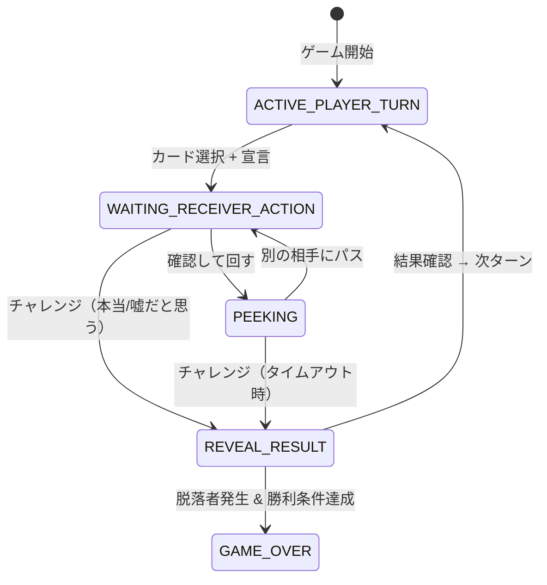

# 🪳 はったりポーカー — ゲーム仕様書

> **バージョン**: v1.0.2
> **最終更新**: 2026-03-14
> **技術スタック**: Vite + React 19 + TypeScript (フロントエンド) / Express + Socket.IO (バックエンド)

---

## 目次

1. [概要](#1-概要)
2. [技術アーキテクチャ](#2-技術アーキテクチャ)
3. [データモデル](#3-データモデル)
4. [ルーム管理](#4-ルーム管理)
5. [ゲームフロー](#5-ゲームフロー)
6. [カードシステム](#6-カードシステム)
7. [フェーズ遷移](#7-フェーズ遷移)
8. [ゲームモード](#8-ゲームモード)
9. [イベントシステム](#9-イベントシステム)
10. [スキルシステム](#10-スキルシステム)
11. [サバイバルモード](#11-サバイバルモード)
12. [称号システム](#12-称号システム)
13. [チャットシステム](#13-チャットシステム)
14. [観戦システム](#14-観戦システム)
15. [統計データ](#15-統計データ)
16. [リプレイログ](#16-リプレイログ)
17. [タイムアウト処理](#17-タイムアウト処理)
18. [切断・再接続](#18-切断再接続)
19. [情報秘匿](#19-情報秘匿)
20. [サウンドシステム](#20-サウンドシステム)
21. [設定システム](#21-設定システム)
22. [隠し機能](#22-隠し機能)
23. [通信プロトコル](#23-通信プロトコル)
24. [ビルド・デプロイ](#24-ビルドデプロイ)

---

## 1. 概要

「はったりポーカー」は、ブラフ（はったり）と心理戦を中心としたオンラインマルチプレイヤーカードゲームである。プレイヤーは手札のカードを相手に渡す際、カードの種類を宣言する。宣言は本当でも嘘でもよく、受け手はそれを見抜くか信じるかを選択する。

### 基本コンセプト
- **サーバー権威型**: すべてのゲームロジックはサーバー側で処理される
- **リアルタイム通信**: Socket.IOによるWebSocket通信
- **情報秘匿**: 各プレイヤーには自分の手札のみが公開される

---

## 2. 技術アーキテクチャ

### フロントエンド
| 項目 | 技術 |
|:---|:---|
| フレームワーク | React 19.2.0 |
| ビルドツール | Vite 7.3.1 |
| 言語 | TypeScript 5.9.3 |
| 通信 | socket.io-client 4.8.3 |
| サウンド | Web Audio API（外部ファイル不要） |
| 状態管理 | React Context API + useSocket カスタムフック |

### バックエンド
| 項目 | 技術 |
|:---|:---|
| フレームワーク | Express 5.1.0 |
| 通信 | Socket.IO 4.8.3 |
| バンドル | esbuild → CJS形式 |
| 実行ファイル化 | @yao-pkg/pkg (node20-win-x64) |

### ディレクトリ構成

```
cockroach-poker/
├── shared/types.ts        # サーバー・クライアント共通型定義
├── server/server.ts       # ゲームサーバー（全ロジック）
├── src/
│   ├── App.tsx            # エントリーポイント・画面遷移
│   ├── index.css          # 全スタイル定義
│   ├── core/
│   │   ├── useSocket.ts       # Socket.IO通信フック
│   │   ├── useSoundEffects.ts # サウンドエフェクト生成
│   │   ├── useToast.ts        # トースト通知
│   │   ├── gameEngine.ts      # ローカルゲームエンジン（未使用）
│   │   ├── types.ts           # クライアント固有型
│   │   ├── SecretModeContext.tsx  # 隠しモードコンテキスト
│   │   └── SettingsContext.tsx    # 設定コンテキスト
│   └── components/
│       ├── LobbyScreen.tsx        # ロビー画面
│       ├── OnlineGameBoard.tsx    # ゲームプレイ画面
│       ├── OnlineGameOverScreen.tsx # ゲーム終了画面
│       ├── ChatBox.tsx            # チャットUI
│       ├── SettingsModal.tsx      # 設定モーダル
│       ├── DeclarationModal.tsx   # 宣言モーダル
│       ├── CardComponent.tsx      # カードコンポーネント
│       ├── ReplayModal.tsx        # リプレイモーダル
│       └── ToastContainer.tsx     # トースト通知表示
├── server-bundle.cjs      # バンドル済みサーバー
├── build-exe.js           # ビルドスクリプト
└── package.json
```

---

## 3. データモデル

### 3.1 カード (Card)
```typescript
interface Card {
  cardId: string;        // 例: "cockroach_00"
  creatureType: CreatureType;
}
```

### 3.2 プレイヤー (Player) — サーバー内部
```typescript
interface Player {
  playerId: string;      // "player_0", "player_1", ...
  displayName: string;
  hand: Card[];          // 手札（サーバーのみ保持）
  tableCards: Card[];    // 場に公開されたカード
  isEliminated: boolean; // 脱落フラグ
  seatIndex: number;     // 座席位置
  sp: number;            // スキルポイント
}
```

### 3.3 プレイヤービュー (PlayerView) — クライアント送信用
```typescript
interface PlayerView {
  playerId: string;
  displayName: string;
  handCount: number;     // 他プレイヤーには枚数のみ
  hand?: Card[];         // 自分のみ手札データを受信
  tableCards: Card[];
  isEliminated: boolean;
  seatIndex: number;
  sp: number;
}
```

### 3.4 ルーム (Room) — サーバー内部
```typescript
interface Room {
  roomId: string;                    // 5文字の英数字ID
  hostSocketId: string;
  hostPlayerId: string;
  maxPlayers: number;                // 2〜6
  status: 'WAITING' | 'IN_GAME' | 'FINISHED';
  members: Map<socketId, {playerId, displayName}>;
  disconnectedPlayers: Map<playerId, {displayName, timer}>;
  turnTimer: ReturnType<typeof setTimeout> | null;
  turnDeadline: number | null;       // Unix timestamp (ms)
  rematchAccepted: Set<playerId>;
  spectators: Set<socketId>;
  gameMode: 'normal' | 'event' | 'skill';
  playerStats: Map<playerId, PlayerStats>;
  eventInterval: 1 | 2 | 3 | 4 | 5 | 'random';
  activeEvent: ActiveEvent | null;
  barrierActive: boolean;
  doubleRiskActive: boolean;
  lockedDeclareType: CreatureType | null;
  rouletteTarget: string | null;
  attackActiveBy: string | null;
  shieldActive: boolean;
  changePending: boolean;
  salvationPending: {playerId, cardCount}[] | null;
  replayLog: ReplayEntry[];
  gameState: GameState | null;
  secretMode: boolean;
  turnTimeoutMs: number;             // ミリ秒
  survivalMode: boolean;
}
```

### 3.5 ルーム情報 (RoomInfo) — クライアント送信用
```typescript
interface RoomInfo {
  roomId: string;
  hostPlayerId: string;
  players: {playerId, displayName}[];
  maxPlayers: number;
  status: 'WAITING' | 'IN_GAME' | 'FINISHED';
  gameMode: GameMode;
  eventInterval: EventInterval;
  secretMode?: boolean;
  survivalMode?: boolean;
}
```

---

## 4. ルーム管理

### 4.1 ルームID生成
- 文字セット: `ABCDEFGHJKLMNPQRSTUVWXYZ23456789`（紛らわしい文字を除外）
- 長さ: 5文字
- 例: `S5CP2`, `R7ELY`

### 4.2 ルーム作成
| パラメータ | デフォルト | 範囲 |
|:---|:---|:---|
| maxPlayers | 4 | 2〜6 |
| gameMode | `normal` | `normal` / `event` / `skill` |
| eventInterval | 3 | 1〜5 / `random` |
| turnTimeout | 180秒 | 60〜300秒 |
| secretMode | false | boolean |
| survivalMode | false | boolean |

- ホスト（ルーム作成者）の playerId は `player_0`
- 名前のたぬき変換: 特定キーワード（ぽろあーく, poro, 狐 など）を含む名前は「たぬき」に変換

### 4.3 ルーム参加
- ルームID（大文字小文字不問）で参加
- 参加条件: ステータスが `WAITING` かつ定員未満
- playerId は `player_{0からの連番}`

### 4.4 ルーム離脱・削除
- **待機中の離脱**: 即座にメンバー削除。ホスト離脱時は次のメンバーがホストに昇格
- **ゲーム中のホスト退室**: ルーム強制クローズ（`room_closed`イベント送信）
- **全メンバー離脱**: ルーム自動削除

---

## 5. ゲームフロー

### 5.1 ゲーム開始条件
- ホストのみがゲームを開始可能
- 最低2人のプレイヤーが必要

### 5.2 初期化処理
1. 64枚のデッキを**シャッフル**（Fisher-Yates アルゴリズム）
2. プレイヤー数で**均等配布** `Math.floor(64 / プレイヤー数)` 枚ずつ
3. **開始プレイヤーをランダム選択**
4. 統計データ初期化
5. リプレイログ初期化

### 5.3 カード配布枚数
| 人数 | 1人あたり | 余り |
|:---:|:---:|:---:|
| 2人 | 32枚 | 0枚 |
| 3人 | 21枚 | 1枚（先頭プレイヤーに付与） |
| 4人 | 16枚 | 0枚 |
| 5人 | 12枚 | 4枚（先頭プレイヤーに付与） |
| 6人 | 10枚 | 4枚（先頭プレイヤーに付与） |

### 5.4 勝利条件
- **通常ルール**: 最初の脱落者が出た時点で、生存者の中で場のカードが最も少ないプレイヤーが勝利
- **サバイバルモード**: 最後の1人まで続行。生存者が1人以下で終了
- **全員手札切れ**: 場のカードが最も少ないプレイヤーが勝利

### 5.5 勝者判定のタイブレーク
場のカード枚数が同じ場合: **同種カード最大枚数が少ないプレイヤー**が勝利

---

## 6. カードシステム

### 6.1 生き物カード一覧

| 種類 | 名前 | 絵文字 | カード枚数 |
|:---|:---|:---:|:---:|
| COCKROACH | ゴキブリ | 🪳 | 8枚 |
| RAT | ネズミ | 🐀 | 8枚 |
| FLY | ハエ | 🪰 | 8枚 |
| TOAD | ヒキガエル | 🐸 | 8枚 |
| SCORPION | サソリ | 🦂 | 8枚 |
| BAT | コウモリ | 🦇 | 8枚 |
| STINKBUG | カメムシ | 🪲 | 8枚 |
| SPIDER | クモ | 🕷️ | 8枚 |

- 合計: **8種類 × 8枚 = 64枚**

### 6.2 脱落条件
- **同じ種類のカードが場に4枚**揃ったプレイヤーは即座に脱落
- 定数: `ELIMINATION_COUNT = 4`
- **手札が0枚**になったプレイヤーは即座に脱落（カード送出時に判定）

---

## 7. フェーズ遷移

### 7.1 フェーズ一覧

| フェーズ | 説明 | アクション待ち |
|:---|:---|:---|
| `ACTIVE_PLAYER_TURN` | 手番プレイヤーがカードを選択 | 手番プレイヤー |
| `WAITING_RECEIVER_ACTION` | 受け手がアクション選択 | 受け手 |
| `PEEKING` | 受け手がカードを確認中（パス先選択待ち） | 確認者 |
| `REVEAL_RESULT` | チャレンジ結果表示中 | 任意のプレイヤー |
| `GAME_OVER` | ゲーム終了 | — |

### 7.2 フェーズ遷移図



### 7.3 ACTIVE_PLAYER_TURN（カード選択フェーズ）

手番プレイヤーのアクション:
1. 手札からカードを1枚選択
2. 渡す相手を選択（生存中の他プレイヤー）
3. 宣言する生き物を選択（実際のカードと一致しなくてもよい）

**制約:**
- ロックイベント時: 指定された生き物しか宣言不可
- ルーレットイベント時: ランダムに指定された相手にしか渡せない

### 7.4 WAITING_RECEIVER_ACTION（受け手選択フェーズ）

受け手の選択肢:
- ✅ **「本当だと思う」** — 宣言通りなら送り手がカードを引き取り、違えば受け手が引き取り
- ❌ **「嘘だと思う」** — 宣言と違えば送り手がカードを引き取り、宣言通りなら受け手が引き取り
- 👀 **「確認して回す」** — カードの中身を見て、別の人に新しい宣言で渡す

**パス先制約:**
- 元の送り手には回せない
- 過去にこのカードを経由した人（passHistory）には回せない
- パスできる相手がいない場合は「確認して回す」が選べない

### 7.5 PEEKING（確認中フェーズ）

確認者のアクション:
- 別の相手を選択して新しい宣言でパス
- ロックイベント制約が適用される

### 7.6 REVEAL_RESULT（結果表示フェーズ）

- カードがフリップアニメーションで公開される
- チャレンジ結果（正解/不正解）が表示される
- **任意のプレイヤー**がOKボタンで確認可能
- 確認後の処理:
  1. カード引き取り者(loser)の脱落チェック
  2. アタックスキル効果の適用
  3. 勝利判定
  4. 次ターンの手番はカード引き取り者

### 7.7 次ターンへの移行処理
1. イベント効果クリア
2. スキル効果クリア
3. ターンカウント+1
4. イベント発動判定（イベントモード時）
5. ターンタイマーリセット

---

## 8. ゲームモード

### 8.1 ノーマルモード (`normal`)
- 純粋なブラフと心理戦のみ
- イベントもスキルも発動しない

### 8.2 イベントモード (`event`)
- 一定ターンごとにランダムイベントが発動
- 詳細は[セクション9](#9-イベントシステム)参照

### 8.3 スキルモード (`skill`)
- チャレンジ結果に応じてSPを獲得し、スキルを使用可能
- 詳細は[セクション10](#10-スキルシステム)参照

---

## 9. イベントシステム

### 9.1 発動条件
- ゲームモードが `event` の場合のみ
- **固定間隔**: N ターンごと（N = 1〜5, ターンカウント > 1 かつ `(turnCount - 1) % N === 0`）
- **ランダム**: 各ターン開始時に20%の確率で発動

### 9.2 イベント一覧

| イベント | 絵文字 | 効果 | 持続 |
|:---|:---:|:---|:---:|
| シャッフル | 🔄 | 全生存プレイヤーの手札をまとめて再配布 | 即時 |
| リーク | 👀 | 各生存プレイヤーの手札1枚をランダム公開 | 情報表示 |
| バリア | 🛡️ | チャレンジ失敗でもカードを受け取らない（カードは送り手の手札に戻る） | 1ターン |
| ルーレット | 🎲 | カードを渡す相手が手番プレイヤー以外からランダムに1人決定 | 1ターン |
| ダブルリスク | ⚡ | チャレンジ失敗時、引き取り者の手札からランダム1枚も追加で場に出る | 1ターン |
| ロック | 🔒 | ランダムに選ばれた1種類の生き物しか宣言できない | 1ターン |
| 救済 | 🙏 | 場カード最多のプレイヤーが場カード1枚を別プレイヤーの場に移動可能（同率は全員対象） | 選択完了まで |

### 9.3 イベント効果の詳細

#### シャッフル
1. 全生存プレイヤーの手札を1つの山にまとめる
2. Fisher-Yates でシャッフル
3. 均等配布（余りは最初のプレイヤーに）

#### リーク
- 各プレイヤーの手札からランダム1枚を選び、プレイヤー名+カード情報を全員に公開
- カードは手札から移動しない（情報のみ公開）

#### バリア
- `barrierActive = true` をセット
- チャレンジ結果が「受け手が外れ」の場合、カードは送り手の手札に戻る
- バリア効果は1回使用で消費

#### 救済
- 場カード枚数が最多のプレイヤーを全員特定（同率は全員対象）
- 対象プレイヤーが送り先プレイヤーを選択
- 場カードの最後の1枚を選択先の場に移動

### 9.4 イベント効果のクリアタイミング
- **ターン終了時**（REVEAL_RESULT→次のACTIVE_PLAYER_TURNへの遷移時）にすべてクリア

---

## 10. スキルシステム

### 10.1 SP（スキルポイント）システム

| 条件 | 獲得SP |
|:---|:---:|
| チャレンジ成功（嘘を見抜いた） | +2 |
| ブラフ成功（嘘を信じさせた） | +1 |
| 正直宣言でチャレンジを誘い成功 | +1 |

- **SP上限**: 5
- スキルモード（`gameMode === 'skill'`）でのみ獲得・使用可能

### 10.2 スキル一覧

| スキル | コスト | 使用タイミング | 効果 |
|:---|:---:|:---|:---|
| ⚔️ アタック | 3 SP | WAITING_RECEIVER_ACTION（カードを受け取った時） | チャレンジ成功時、カードを引き取った人(loser)の場カードを場カード最少の他プレイヤーに移す |
| 🔀 チェンジ | 2 SP | WAITING_RECEIVER_ACTION（カードを受け取った時） | 送り手にカードの渡し先を選び直させる（自分とpassHistory上の人を除外） |
| 🛡️ シールド | 4 SP | PEEKING（確認後、パス前） | パス先のプレイヤーがチャレンジ不可になる（パスのみ可） |
| 💚 ヒール | 5 SP | ACTIVE_PLAYER_TURN（自分のターン開始時） | 場のカード1枚（インデックス指定可、デフォルト最後の1枚）を手札に戻す |

### 10.3 スキル効果のクリアタイミング
- ターン終了時: `attackActiveBy`, `shieldActive`, `changePending` をすべてリセット

---

## 11. サバイバルモード

### 11.1 概要
- 3人以上のゲームで使用可能なオプション
- ルーム作成時にトグルで設定

### 11.2 ゲーム終了条件の比較
| モード | 終了条件 | 勝者判定 |
|:---|:---|:---|
| 通常ルール | 最初の1人が脱落 | 生存者のうち場カード最少 |
| サバイバル | 生存者が1人以下 | 最後の生存者 |

---

## 12. 称号システム

### 12.1 概要
- ゲーム終了時に各プレイヤーのプレイスタイルに応じて称号を付与
- 同率の場合は**付与しない**（ユニーク制）

### 12.2 称号一覧

| 絵文字 | 称号 | 条件 |
|:---:|:---|:---|
| 🐔 | チキン | 一度もチャレンジしなかった |
| 😰 | いつも最後 | パスできない最後の手番に最も多くなった |
| 🔥 | 勝負師 | 即チャレンジ（回さずにチャレンジ）成功が最多 |
| 💥 | 無謀 | 即チャレンジ失敗が最多 |
| 🎯 | 一撃必殺 | チャレンジ無敗（失敗0 & 成功1回以上） |
| 🎭 | ブラフマスター | 嘘の宣言で騙した回数最多 |
| 🔍 | 名探偵 | 嘘を見抜いた回数最多 |
| 😇 | 正直者 | 正直宣言でチャレンジを誘った成功回数最多 |
| 🤥 | 嘘つき王 | 嘘がバレた回数最多 |
| 🔄 | たらい回し職人 | 「確認して回す」回数最多 |
| 🪳 | 〇〇好き | 特定の生き物を3回以上宣言 & 最多 |
| 🏆 | 完全勝利 | 勝者かつカードを1枚も受け取っていない |

---

## 13. チャットシステム

### 13.1 機能
- **テキストメッセージ**: 最大50文字
- **クイックメッセージ**: プリセットの短文メッセージ（「ナイス！」「えっ！？」「どうぞ」「待って」「うーん…」「本当に？」「ありがとう」「ごめんね」）
- **スタンプ**: 絵文字スタンプ12種（😂🤣😭😱🤔🫣😈🤯🎉👏🙏💀）

### 13.2 観戦者制限
- 観戦者（`isSpectator`）の場合、送信フォーム・クイックメッセージ・スタンプは非表示
- 「👁️ 観戦中のためチャットできません」を表示

### 13.3 通知
- 新着メッセージ時に未読バッジを表示
- チャット画面は折り畳み式（右下に💬ボタン）

---

## 14. 観戦システム

### 14.1 概要
- ルームIDを指定して観戦者として参加可能
- 観戦者にはすべてのプレイヤーの手札が**非公開**（`filterStateForPlayer`に`'__spectator__'`を渡す）
- 観戦者数は全プレイヤーにリアルタイム通知

### 14.2 制約
- 観戦者はゲームに干渉不可
- チャット送信不可
- ゲーム中のみ観戦可能

---

## 15. 統計データ

### 15.1 記録項目 (PlayerStats)

| 項目 | 説明 |
|:---|:---|
| bluffSuccess | 嘘の宣言で騙したカウント |
| bluffFail | 嘘がバレたカウント |
| truthSuccess | 正直宣言でチャレンジ誘い成功カウント |
| detectSuccess | 嘘を見抜いたカウント |
| detectFail | 本当を嘘と誤判断カウント |
| passCount | 確認して回した回数 |
| challengeCount | チャレンジ合計回数 |
| immediateChallengeSuccess | 回さずに即チャレンジ成功回数 |
| immediateChallengeFail | 回さずに即チャレンジ失敗回数 |
| lastReceiverCount | パスできない最後の手番になった回数 |
| declarationCounts | 生き物種別ごとの宣言回数 |
| cardsReceived | カードを受け取った(引き取った)総枚数 |

### 15.2 「即チャレンジ」の判定
- `passHistory.length === 1`（送り手のみ = 最初の受取人がすぐチャレンジした場合）

---

## 16. リプレイログ

### 16.1 エントリー構造
```typescript
interface ReplayEntry {
  turn: number;
  action: 'GAME_START' | 'DECLARE' | 'CHALLENGE' | 'RESULT'
        | 'PASS' | 'PEEK' | 'ELIMINATE' | 'EVENT'
        | 'SKILL' | 'SALVATION' | 'GAME_OVER';
  playerName: string;
  detail: string;
  emoji: string;
  timestamp: number;     // Unix timestamp (ms)
}
```

### 16.2 記録タイミング
- ゲーム開始、カード宣言、チャレンジ、結果、パス、確認、脱落、イベント発動、スキル使用、救済、ゲーム終了

### 16.3 表示
- ゲーム終了画面で「📜 リプレイ」ボタンからモーダル表示
- ターンごとにグループ化して時系列表示

---

## 17. タイムアウト処理

### 17.1 設定
- デフォルト: 180秒 (`DEFAULT_TURN_TIMEOUT_MS = 180,000ms`)
- 設定範囲: 60〜300秒（ルーム作成時に設定）
- ターンタイマーは `ACTIVE_PLAYER_TURN`, `WAITING_RECEIVER_ACTION`, `PEEKING`, `REVEAL_RESULT` の4フェーズで稼働

### 17.2 タイムアウト時の自動行動

| フェーズ | 自動行動 |
|:---|:---|
| ACTIVE_PLAYER_TURN | ランダムなカードをランダムな相手にランダムな宣言で送る |
| WAITING_RECEIVER_ACTION | 自動で「嘘だと思う」チャレンジ |
| PEEKING | 自動で「嘘だと思う」チャレンジ |
| REVEAL_RESULT | 自動で結果確認を進める（脱落チェック→次ターンまたはGAME_OVER） |

### 17.3 クライアント側カウントダウン
- サーバーから `turnDeadline` (Unix timestamp) を受信
- クライアントはリアルタイムに残り秒数を計算・表示（`useCountdown`フック）

---

## 18. 切断・再接続

### 18.1 切断猶予
- ゲーム中の切断: **30秒**の猶予期間（`DISCONNECT_TIMEOUT_MS = 30,000ms`）
- 猶予期間中は他プレイヤーに「(切断中)」と表示
- 猶予期間切れ: プレイヤーを完全削除

### 18.2 再接続フロー
1. クライアントはセッション情報(`cp_playerId`, `cp_roomId`)を`sessionStorage`に保存
2. Socket.IO再接続時に自動で`reconnect_game`イベントを送信
3. サーバーは`disconnectedPlayers`から該当プレイヤーを検索
4. 一致すれば切断タイマーを解除し、現在のゲーム状態を送信
5. ホストが再接続した場合はホスト情報も更新

### 18.3 待機中の切断
- 即座にメンバー削除（猶予期間なし）
- 全メンバー離脱でルーム削除

---

## 19. 情報秘匿

### 19.1 filterStateForPlayer 関数
サーバーの完全なGameStateをプレイヤーごとにフィルタリング:

| 情報 | 自分 | 他プレイヤー | 観戦者 |
|:---|:---:|:---:|:---:|
| 手札のカード内容 | ✅ | ❌（枚数のみ） | ❌ |
| 場のカード | ✅ | ✅ | ✅ |
| 移動中カードの中身 | 確認中/結果時のみ | 結果時のみ | 結果時のみ |
| パス可能な相手一覧 | ✅ | ✅ | ✅ |

### 19.2 観戦者ビュー
- `playerId = '__spectator__'` として処理
- 手札は非公開、カード確認中の中身も非公開

---

## 20. サウンドシステム

### 20.1 概要
- **Web Audio API**を使用してリアルタイム生成（外部サウンドファイル不要）
- オシレーター、和音、ノイズバーストを組み合わせ
- ADSR風エンベロープ制御

### 20.2 サウンドエフェクト一覧

| 効果音 | トリガー | 音色の特徴 |
|:---|:---|:---|
| cardPlace | カード配置 | 三角波の短いポップ音 |
| challenge | チャレンジ | ノコギリ波の緊張感ある上昇音 |
| reveal | カード公開 | 矩形波→正弦波のドラマチック揭示音 |
| eliminate | 脱落 | 下降トレモロ + ノイズバースト |
| victory | 勝利 | 正弦波のファンファーレ（和音アルペジオ） |
| tick | タイマーティック | 短い正弦波 |
| click | UIクリック | 短い正弦波 |
| eventTrigger | イベント発動 | 神秘的なパッドサウンド |
| skillUse | スキル使用 | パワーアップ風上昇音 |
| turnStart | ターン開始 | ベル風チャイム |
| cardPass | カードパス | ノイズバースト + 下降トーン |
| correct | 正解 | 明るい和音3連 |
| wrong | 不正解 | 不協和和音 + ブザー |

---

## 21. 設定システム

### 21.1 設定項目

| 項目 | デフォルト | 範囲 | 保存先 |
|:---|:---|:---|:---|
| BGM音量 | 50% | 0〜100% | localStorage |
| SE音量 | 50% | 0〜100% | localStorage |
| 通知音 | ON | ON/OFF | localStorage |
| アニメ速度 | 普通 | 普通/速い | localStorage |
| 背景の暗さ | 30% | 0〜90% | localStorage |
| フォントサイズ | 中 | 小/中/大 | localStorage |
| チャット通知 | ON | ON/OFF | localStorage |

### 21.2 設定UI
- 画面右下の⚙️ボタンからモーダル表示
- 「デフォルトに戻す」ですべてリセット
- ルーム参加中は「🚪 退室する」ボタンも表示（確認ダイアログ付き）

---

## 22. 隠し機能

### 22.1 たぬきモード（コナミコマンド）
- **発動方法**: ロビー画面で `↑↑↓↓←→←→` を入力
- **効果**:
  - フラッシュ演出「🐾 たぬきモード 解放！」を表示
  - サソリのカードが「タヌキ」に変更（名前・絵文字・色）
  - 専用BGM（`/images/poro.mp3`）がループ再生
  - ホストが発動した場合、ルーム内全員に伝播
- **状態管理**: `SecretModeContext`で管理、`localStorage`に保存

### 22.2 名前キーワード変換
特定のキーワードを含む名前は「たぬき」に自動変換:
`ぽろあーく`, `ポロアーク`, `poro`, `polo`, `狐`, `キツネ`, `じゃい`, `じゃない`

---

## 23. 通信プロトコル

### 23.1 クライアント→サーバー イベント

| イベント | データ | 説明 |
|:---|:---|:---|
| `create_room` | playerName, maxPlayers?, gameMode?, eventInterval?, secretMode?, turnTimeout?, survivalMode? | ルーム作成 |
| `join_room` | roomId, playerName | ルーム参加 |
| `start_game` | — | ゲーム開始（ホストのみ） |
| `select_card` | cardId, targetPlayerId, declaredType | カード選択+宣言 |
| `challenge` | believeIsLying | チャレンジ |
| `peek_card` | — | カード確認 |
| `pass_card` | targetPlayerId, declaredType | カードをパス |
| `confirm_result` | — | 結果確認 |
| `reconnect_game` | playerId, roomId | 再接続 |
| `rematch` | — | 再戦リクエスト |
| `send_chat` | message | チャットメッセージ送信 |
| `join_as_spectator` | roomId | 観戦参加 |
| `use_skill` | skillType, targetPlayerId?, tableCardIndex? | スキル使用 |
| `change_select_target` | targetPlayerId | チェンジスキルのターゲット選択 |
| `salvation_select_target` | targetPlayerId | 救済の送り先選択 |
| `leave_room` | — | ルーム退出 |

※ すべてのイベントにコールバック `(res: {ok, error?}) => void` が付与される

### 23.2 サーバー→クライアント イベント

| イベント | データ | 説明 |
|:---|:---|:---|
| `room_update` | RoomInfo | ルーム情報更新 |
| `game_state_update` | GameStateView | ゲーム状態更新 |
| `player_eliminated` | playerId, playerName, creatureType | プレイヤー脱落通知 |
| `game_over` | winnerName, winnerId | ゲーム終了通知 |
| `player_disconnected` | playerId, playerName | プレイヤー切断通知 |
| `player_reconnected` | playerId, playerName | プレイヤー再接続通知 |
| `rematch_requested` | requestedBy, acceptedCount, totalCount | 再戦リクエスト通知 |
| `rematch_start` | — | 再戦開始通知 |
| `chat_message` | playerId, playerName, message, timestamp | チャットメッセージ受信 |
| `spectator_update` | spectatorCount | 観戦者数更新 |
| `error` | code, message | エラー通知 |
| `room_closed` | reason | ルーム閉鎖通知 |

---

## 24. ビルド・デプロイ

### 24.1 開発
```bash
npm run dev          # Vite開発サーバー起動 (port 5173)
node server-bundle.cjs   # ゲームサーバー起動 (port 3001)
```

### 24.2 ビルド
```bash
npm run build        # TypeScriptコンパイル + Viteビルド → dist/
npm run build:server # esbuildでserver.tsをCJSバンドル → server-bundle.cjs
npm run build:exe    # pkg でWindows実行ファイル化 → release/
```

### 24.3 本番配信
- サーバーが`dist/`フォルダを自動検出し、静的ファイルとして配信
- SPAフォールバック対応（index.htmlにフォールバック）
- distフォルダの探索順: exe横 → ../dist → ./dist

### 24.4 ネットワーク
- デフォルトポート: `3001`（環境変数`PORT`で変更可能）
- バインドアドレス: `0.0.0.0`（LAN全インターフェース）
- CORS: `origin: '*'`
- LAN IPアドレス自動検出・表示

### 24.5 cloudflaredトンネル（インターネット公開）
- **アカウント不要**のCloudflareトンネルに対応
- `cloudflared.exe`が同ディレクトリにあれば自動起動
- `https://xxxxx.trycloudflare.com` の公開URLを自動取得・表示
- プロセス終了時にcloudflaredも自動停止
- 探索順: exe横 → カレントディレクトリ → PATH

### 24.6 ヘルスチェック
```
GET /health → { status: 'ok', rooms: <ルーム数> }
```
